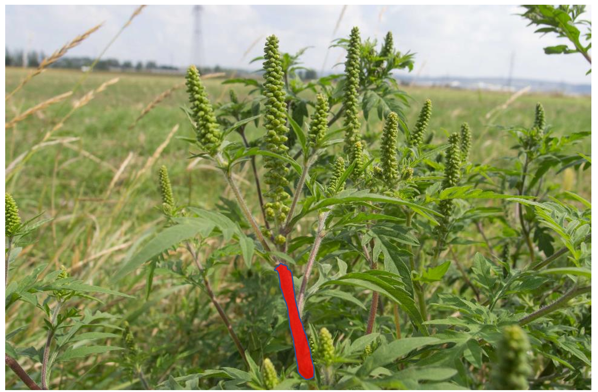

# Interdisciplinary Project in Data Science
The following outlines an idea to fight the spread of ragweed by the use of modern computer vision systems combined with autonomous aerial drones. 

## Introduction
* ~10% of Austria`s population suffer from severe allergic reactions to ragweed.
* Ragweed is an adventive weed that aggressively spreads across Europe. 
* This results in estimated annual cost of 275 million EUR for Austria`s health system.  

https://www.meduniwien.ac.at/web/ueber-uns/news/detailseite/2019/news-im-juli-2019/ragweed-finder-app-der-meduni-wien-als-aktionsplan-fuer-ganz-oesterreich/ 

The first goal is to train a computer vision model to detect ragweed in images taken from mobile phones or cameras mounted to aerial drones. 

A prototype using ResNet18 transferlearned with 60 Images already provides a reasonable performance in distinguishing ragweed from a similar looking hemp weed. 

Using additional Training data should further improve the models performance. 
It might also be possible to compress and deploy this to model to the device.

## Extension to Master Thesis 

An advanced goal would be to not only identify ragweed in images but also to train robots to displant them.
For that it might be good to compute the position of the main stem: 

### Platform

Another subproblem is to identify an optimal robotic platform thats capable of displanting ragweed. 
Boston Dynamics Spot Mini might out of the box be capable to perform this task https://www.bostondynamics.com/spot.

It might also be a solution to use aerial drones to fight ragweed with herbizide as shown in this video: 
https://www.youtube.com/watch?v=Qmla9NLFBvU&t=466s

### Reinforcement-learned Flight Controller
A hard problem might be to design an algorithm that allows cheap drones to performe long-range energy-efficient vegetation scans. 
All without crashing into pedestrians/cars or other objects. This might require the simulation of drones in virtual environments.

## Q&A from an Interview with Domain Experts

Can the plant reproduce itself after removal?
A: The seed can grow a new plant within 40 years. So the best would be to remove the plant before it grows new seeds. Ragweed can only grow a single time from one seed. 
How many days would we be affected by cross border pollen?
A: On ~12 days a year the weather conditions expose Vienna to pollen from Hungary. 
Current regulations related to ragweed?
A: Burgenland has a law. If you find ragweed you need to report it. (It should then be removed by council workers.)

Austria has 83879km² (0,010km² per capita)
How much of the surface needs to be scanned?
A: agriculture areas, railways and streets (the seeds primarily come from transporters and trains from eastern europe.)

Planning Drone missions based on ESA - Sentinel Data?
Computing optimal routes for detecting and fighting ragweed.

